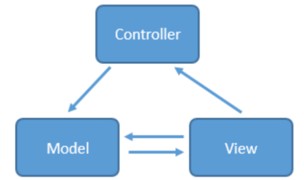
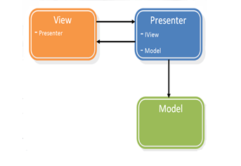

三者比较，<a href="http://zjutkz.net/2016/04/13/%E9%80%89%E6%8B%A9%E6%81%90%E6%83%A7%E7%97%87%E7%9A%84%E7%A6%8F%E9%9F%B3%EF%BC%81%E6%95%99%E4%BD%A0%E8%AE%A4%E6%B8%85MVC%EF%BC%8CMVP%E5%92%8CMVVM/">文章链接 </a>

mvc详解，<a href="http://www.2cto.com/kf/201506/405766.html">文章链接 </a>

model、view、controller
  
视图view；各种java bean，还有一些具体**业务逻辑**对应于model层；至于controller层嘛，当然就是各种activity咯。 

三者比较2，客户端软件架构演变具体过程 <a href="http://www.cnblogs.com/tiantianbyconan/p/5036289.html"> 链接</a>

mvp架构
-----
<a href="http://blog.csdn.net/vector_yi/article/details/24719873">相关文章</a> 
  
View --> UI
IView(view interface) --> view 通过IView 与presenter 交互，降低耦合。
model --> 负责检索、存储、操作数据
presenter --> view/model 中间纽带

#### mvc -->mvp
model --> ；
presenter中 --> 将复杂逻辑处理转移到； 
view --> activity负责mvp中的view：它负责UI initiate，简单逻辑UI，presenter关联。

#### mvp实例
<a href="https://zhuanlan.zhihu.com/p/20312610">mvp例1</a>
<a href="https://zhuanlan.zhihu.com/p/21771642">mvp例2</a>
<a href="http://www.jianshu.com/p/14283d8d3a60">Google_mvp</a>

mvp改进版T-MVP
----
相关文章：
<a href="http://www.jianshu.com/p/b49958e1889d">T-mvp简书</a> 
