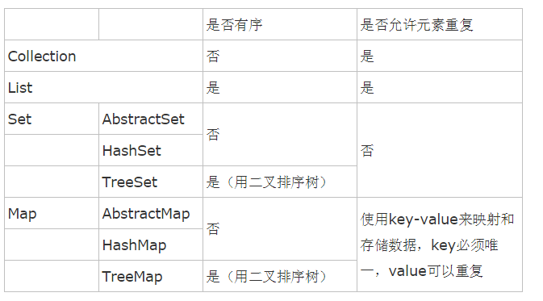

1.HashSet 里面不能存放重复元素，插入输出顺序不一致，
Set<String> words=new HashSet<String>();

while(..){
  ...
  words.add(in.next());
}

2.ArrayList

3.HashMap   key-value形式存储

几个集合的比较

其中，Map均是以key-value形式存储数据。

4.LinkedHashMap比HashMap多一个链表结构，LinkedHashMap是一个
具有双重链表的HashMap,其输出输入顺序是一致的.(队列)

5.keySet()方法返回值是Map中key值的集合；entrySet()的返回值也是返回一个Set集合，此集合的类型为Map.Entry。