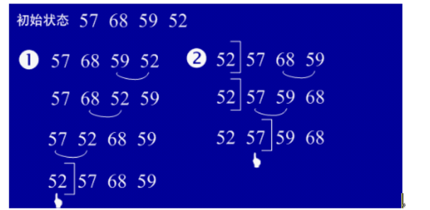

基本排序算法有：选择排序、希尔排序、冒泡排序、快速排序、归并排序、插入排序、二分查找、推排序。 
http://www.cnblogs.com/liuling/p/2013-7-24-01.html 
<a href="http://www.cnblogs.com/liuling/p/2013-7-24-01.html">网址链接</a>
###选择排序
思想：每趟从待排序的记录序列中选择<b>关键字最小</b>的记录放置到已排序表的最前位置，直到全部排完。 
关键问题：在剩余的待排序记录序列中找到最小关键码记录。 
分析

- 简单选择排序是不稳定的排序。
- 时间复杂度：T(n)=O(n2)。

###冒泡排序
基本思想：在要排序的一组数中，对当前还未排好序的范围内的全部数，自上而下对相邻的两个数依次进行比较和调整，让较大的数往下沉，较小的往上冒。即：每当两相邻的数比较后发现它们的排序与排序要求相反时，就将它们互换。 
关键字：大数下沉，小数上冒。  还<b>未排好序的</b>范围内的全部数

分析: 

- 冒泡排序是一种稳定的排序方法。　
- 若文件初状为正序，则一趟起泡就可完成排序，排序码的比较次数为	n-1，且没有记录移动，时间复杂度是O(n)
- 若文件初态为逆序，则需要n-1趟起泡，每趟进行n-i次排序码的比较，且每次比较都移动三次，比较和移动次数均达到最大值∶O(n2)
- 起泡排序平均时间复杂度为O(n2)

###快速排序
基本思想：选择一个基准元素,通常选择第一个元素或者最后一个元素,通过一趟扫描，将待排序列分成两部分,一部分比基准元素小,一部分大于等于基准元素,此时基准元素在其排好序后的正确位置,然后再用同样的方法递归地排序划分的两部分。 
分析

- 快速排序是不稳定的排序。
- 快速排序的时间复杂度为O(nlogn)。
- 当n较大时使用快排比较好，当序列基本有序时用快排反而不好。